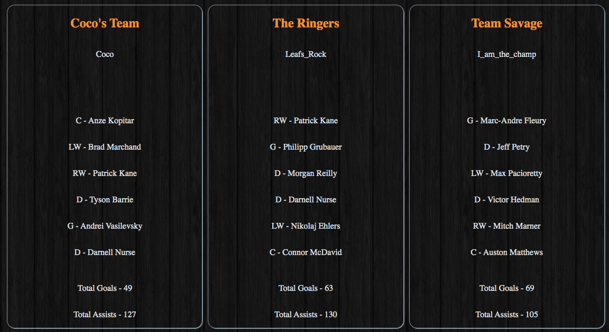
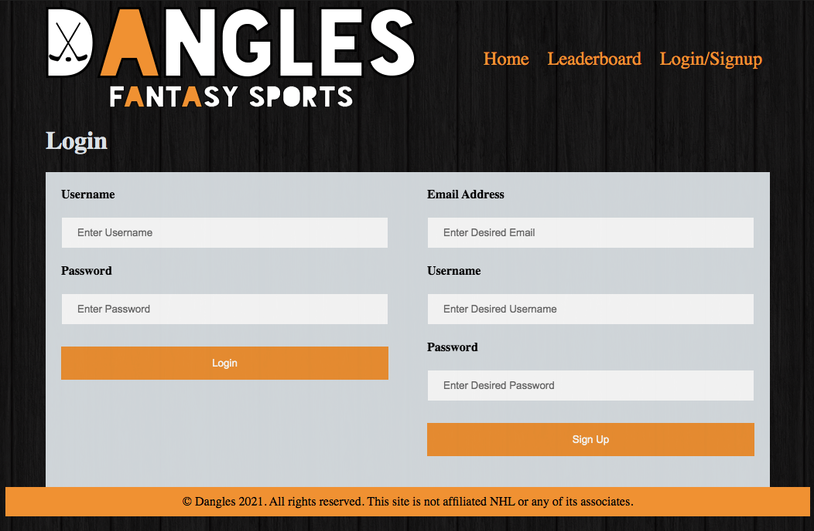
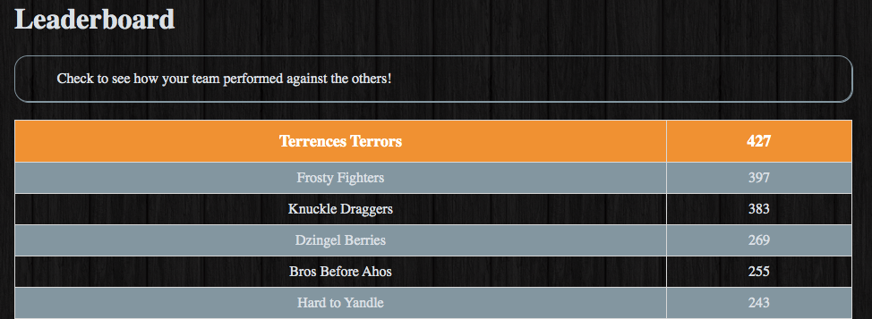

# Dangles Fantasy Sports

1. [Description](#description)
2. [User-Story](#User-Story)
3. [Built-With](#Built-With)
4. [Screenshots](#screenshots)
5. [Deployed-Url](#deployed-url)
6. [Resources](#resources)
7. [Contribution](#contribution)

## Description

Week 16 - Interactive Full-Stack Project, Dangles Fantasy Sports by Group 7

Dangles Fantasy Sports is a website which you can live out your fantasy hockey dreams, beat your friends for the ultimate bragging rights and show why you are a NHL player stats guru!

## User-Story

When a user navigates onto the page from any social media platform, or google search, the user will land on our home page and will be greeted with the sign-up statement and the name of our site, Dangles Fantasy Sports. The user will now see the header with a nav bar that has these headings: Home, Leaderboard, Login/Signup.

When a user navigates to  the Login/Signup page the user will be greeted with our login, Username, Password, section on the left and our Sign Up on our Left which would ask for a Email Address, Username, and Password. 

Once you sign up for the first time you will be greeted with our player selection screen which will navigate through different players and different postions. You will choose 6 players, A Centre, Left Wing, Right Wing, Left Defenseman, Right Defensemen, and Goalie. 

When you are finish selections you will be brought to your homepage which you can track your progress, team points, and you can check the global leaderboard to see how you stack up against other players. 

## Built With
Node.js
Bcrypt
Connect Session Sequelize
Dotenv
Express
Handlebars
Mysql2
Sequelize
Serve-Favicon
NHL API

## Screenshots

Home page displays all created teams including: Name, Username, Players, Points and Assist totals.

Signup and Login Page.

How a user's team is created:

Leaderboard page displays team scores in order from most points to least.

## Deployed-Url:
https://intense-headland-44008.herokuapp.com/

## Resources

The lists of resources used to complete this project:

Google (https://www.google.ca/) and Google Fonts (https://fonts.googleapis.com/css?family=Open+Sans&display=swap).
MDN Web Docs (https://developer.mozilla.org/en-US/docs/Web/JavaScript).
w3schools (https://www.w3schools.com/).
Dword4 NHL API (https://gitlab.com/dword4/nhlapi)
Supports from instructor, assistant instructor and Tutor.

## Contribution
Made with ❤️ by Group 7

Johnny Wu,
Kris Pennimpede,
Rajendra Dhanraj,
Brad Spurrell,
Terrence Chan
